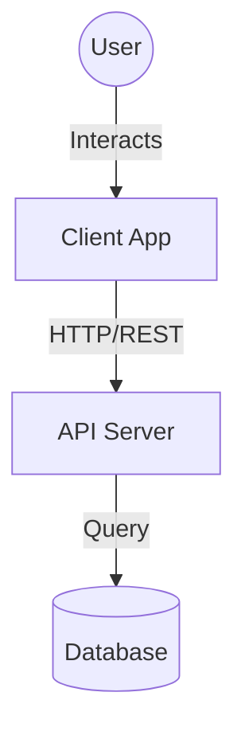
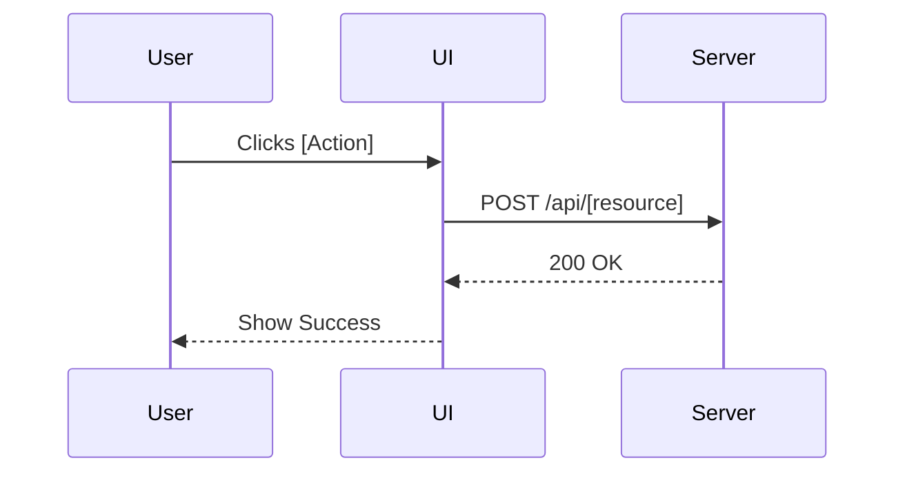

# [Project Name]

> [Short, punching tagline for the project]

[Detailed Project Description: What is the business problem? What is the solution? Who is the target user?]

---

## 📚 Table of Contents

- [🧠 Design Decisions](#-design-decisions)
- [📐 Architecture](#-architecture)
- [🚀 Features](#-features)
- [🛠 Tech Stack](#-tech-stack)
- [🔧 Environment Variables](#-environment-variables)
- [🏁 Getting Started](#-getting-started)
- [🔄 State Management](#-state-management)
- [🔐 Security](#-security)
- [⚡ Performance](#-performance)
- [📂 Directory Structure](#-directory-structure)
- [🧪 Testing](#-testing)
- [🤝 Contributing](#-contributing)
- [📝 License](#-license)

---

## 🧠 Design Decisions

We made the following architectural choices to ensure scalability and maintainability:

| Decision | Alternative Considered | Reason for Choice |
| :--- | :--- | :--- |
| **[e.g. React]** | [Vue, Svelte] | [Reason: e.g. Ecosystem, Team familiarity] |
| **[e.g. Tailwind]** | [SASS, CSS-in-JS] | [Reason: e.g. Development speed, Bundle size] |

## 📐 Architecture

### High-Level Overview



### Critical Flow: [e.g. Login / Checkout]



## � Tech Stack

### Core
-   **Framework**: [e.g. React 18]
-   **Langauge**: [e.g. TypeScript 5.x]
-   **Build Tool**: [e.g. Vite 5]

### Libraries
-   **State**: [e.g. Context API / Redux]
-   **Routing**: [e.g. React Router]
-   **Forms**: [e.g. React Hook Form]
-   **Validation**: [e.g. Zod]
-   **Styling**: [e.g. SASS Modules]

## 🔧 Environment Variables

⚠️ **IMPORTANT**: Never commit `.env` files.

| Variable | Type | Default | Required | Description |
| :--- | :--- | :--- | :--- | :--- |
| `VITE_API_URL` | String | `http://localhost:3000` | Yes | Base URL for the backend API |
| `VITE_ENABLE_ANALYTICS` | Boolean | `false` | No | Toggle tracking |

## 🏁 Getting Started

### Prerequisites
- Node.js `v20.x` or higher
- pnpm `v9.x` (Recommended)

### Installation

```bash
git clone [repo]
cd [folder]
pnpm install
```

### Development

```bash
pnpm dev
```

### Build

```bash
pnpm build
pnpm preview
```

## 🔄 State Management

The application uses **[Context / Redux / Zustand]** for global state.

-   **Store A**: Handles [User Session]
-   **Store B**: Handles [Feature Data]

Data flows unidirectionally. Side effects are handled via [Middleware/useEffect].

## � Security

-   **Authentication**: [e.g. JWT in HTTP-only cookies]
-   **XSS Protection**: All user input is sanitized via [Library].
-   **CSRF**: Tokens are verified on mutation requests.

## ⚡ Performance

-   **Code Splitting**: Routes are lazy-loaded using `React.lazy`.
-   **Asset Optimization**: Images are converted to WebP at build time.
-   **Memoization**: `useMemo` and `useCallback` are used for expensive computations.

## 📂 Directory Structure

```text
src/
├── components/
│   ├── common/       # Atomic, reusable components (Button, Input)
│   └── features/     # Business-logic rich components
├── hooks/            # Shared logic (useAuth, useFetch)
├── services/         # API clients (Axios instances)
├── store/            # Global state definitions
├── types/            # Shared TypeScript interfaces
└── utils/            # Pure functions (date formatting, calculation)
```

## � Testing

We use **[Vitest / Jest]** for unit testing and **[Playwright / Cypress]** for E2E.

| Command | Description |
| :--- | :--- |
| `pnpm test` | Run unit tests |
| `pnpm test:ui` | Open test UI |
| `pnpm coverage` | Generate coverage report |

## ❓ Troubleshooting

### Build fails on CI
-   **Cause**: Lockfile mismatch.
-   **Solution**: Run `pnpm install --frozen-lockfile`.

## 🤝 Contributing

See [CONTRIBUTING.md](./CONTRIBUTING.md) for details.

1.  Fork the repo
2.  Create feature branch (`git checkout -b feature/foo`)
3.  Commit changes (`git commit -am 'Add foo'`)
4.  Push to branch (`git push origin feature/foo`)
5.  Create Pull Request

## 📝 License

Distributed under the MIT License. See `LICENSE` for more information.
