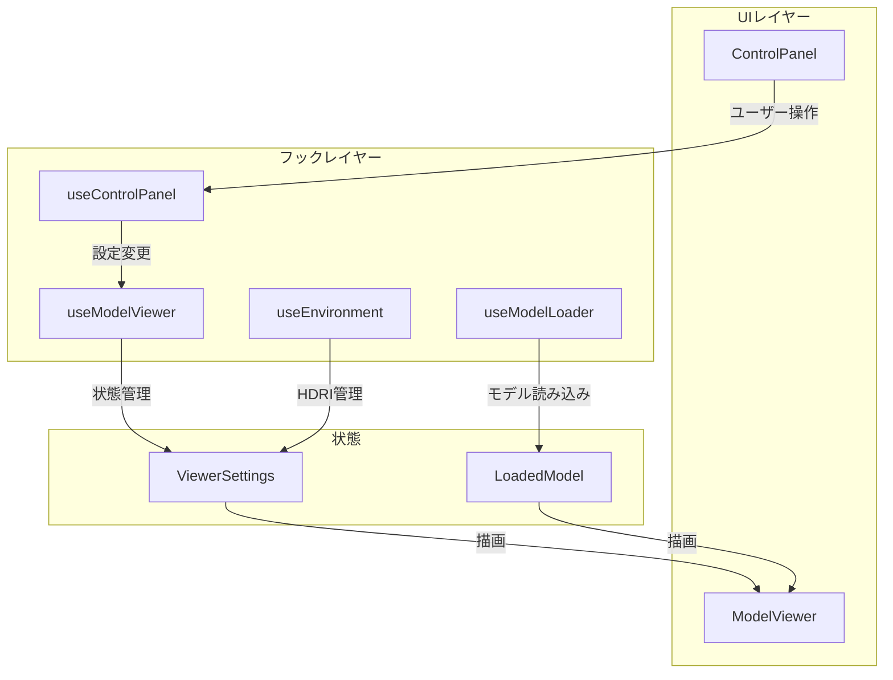

# Model Viewer

React Three Fiberを使用した高品質な3Dモデルビューアー アプリケーション。  
カスタマイズ可能なポストプロセッシングエフェクトと、アコーディオン形式のコントロールパネルを提供します。

---

## 目次

- [機能概要](#機能概要)
- [使用技術](#使用技術)
- [セットアップ](#セットアップ)
- [プロジェクト構成](#プロジェクト構成)
- [アーキテクチャ](#アーキテクチャ)
- [主要コンポーネント](#主要コンポーネント)
- [ポストエフェクト一覧](#ポストエフェクト一覧)
- [設定とカスタマイズ](#設定とカスタマイズ)
- [開発ガイド](#開発ガイド)

---

## 機能概要

### 3Dモデル表示
- **GLB/GLTF形式対応**: ドラッグ&ドロップでモデル読み込み
- **Wireframe表示**: メッシュ構造の確認
- **自動回転**: モデルの360度プレビュー

### 環境設定
- **HDRI環境マップ**: 3種類のプリセット（Sand、Sunset、Studio）
- **環境光調整**: 強度・回転角度のリアルタイム調整
- **背景設定**: 透明/単色の切り替え、カラーピッカーで色選択

### ライティング
- **ディレクショナルライト**: 位置（球面座標）、色、強度を調整
- **方位角/仰角制御**: 直感的なライト配置

### ポストエフェクト
- **10種類のエフェクト**: Bloom、Vignette、DepthOfField、Glitchなど
- **リアルタイムプレビュー**: パラメータ変更を即座に反映

### UI/UX
- **アコーディオン形式パネル**: セクション別に折りたたみ可能
- **再利用可能なUIコンポーネント**: SliderControl、CheckboxControl

---

## 使用技術

### コア技術

| カテゴリ | 技術 | バージョン |
|---------|------|-----------|
| Runtime | React | 19.2.0 |
| Bundler | Vite | 7.2.4 |
| Language | TypeScript | 5.9.3 |
| Styling | Sass (SCSS/Indented) | 1.94.2 |

### 3D/グラフィックス

| ライブラリ | 用途 |
|-----------|------|
| `three` | 3Dレンダリングエンジン |
| `@react-three/fiber` | React向けThree.jsラッパー |
| `@react-three/drei` | 便利なヘルパーコンポーネント |
| `@react-three/postprocessing` | ポストプロセッシング |
| `postprocessing` | エフェクト実装 |

### アニメーション

| ライブラリ | 用途 |
|-----------|------|
| `framer-motion` | Reactアニメーション |
| `gsap` | 高度なアニメーション |

### ルーティング

| ライブラリ | 用途 |
|-----------|------|
| `react-router-dom` | SPA ルーティング |

---

## セットアップ

### 必要な環境

- **Node.js**: v23.7.0 以上
- **パッケージマネージャー**: pnpm（推奨）

### インストール

```bash
# リポジトリをクローン
git clone <repository-url>
cd model-viewer

# 依存関係をインストール
pnpm install
```

### 開発サーバーの起動

```bash
pnpm dev
```

ブラウザで `http://localhost:5173/` を開きます。

### 本番ビルド

```bash
pnpm build
```

出力先: `dist/`

### プレビュー

```bash
pnpm preview
```

---

## プロジェクト構成

```
src/
├── main.tsx                        # エントリーポイント
├── App.tsx                         # ルートコンポーネント
├── App.sass                        # アプリ全体のスタイル
│
├── components/                     # 共通コンポーネント
│   └── Accordion/                  # 折りたたみUI
│       ├── index.tsx               # コンポーネント本体
│       ├── hooks/
│       │   └── useAccordion.ts     # 開閉ロジック
│       └── Accordion.module.sass   # スタイル
│
├── features/
│   └── viewer/                     # 3Dビューアー機能
│       ├── index.ts                # バレルエクスポート
│       ├── types.ts                # 型定義（317行）
│       ├── constants.ts            # デフォルト設定（144行）
│       │
│       ├── components/
│       │   ├── index.ts
│       │   ├── ModelViewer/        # メインビューアー
│       │   │   └── index.tsx
│       │   ├── ControlPanel/       # 設定パネル
│       │   │   ├── index.tsx
│       │   │   ├── ControlPanel.module.sass
│       │   │   └── components/
│       │   │       ├── index.ts
│       │   │       ├── SliderControl.tsx
│       │   │       └── CheckboxControl.tsx
│       │   ├── Model.tsx           # モデル描画
│       │   ├── Environment.tsx     # HDRI環境
│       │   └── PostEffects.tsx     # エフェクト処理
│       │
│       └── hooks/
│           ├── index.ts
│           ├── useModelViewer.ts   # 状態管理（メインフック）
│           ├── useControlPanel.ts  # UIデータ生成
│           ├── useModelLoader.ts   # モデル読み込み
│           ├── useEnvironment.ts   # HDRI管理
│           └── useBackgroundEffect.ts
│
├── styles/                         # グローバルスタイル
│   ├── reset.sass                  # リセットCSS
│   ├── mixins/                     # Sass mixins
│   │   └── _index.sass
│   └── variables/                  # Sass 変数
│       └── _index.sass
│
└── global.d.ts                     # グローバル型定義
```

---

## アーキテクチャ

### 設計原則

1. **ビュー/ロジック分離**: カスタムフックでロジックを分離
2. **Feature-based構成**: 機能単位でディレクトリを分割
3. **型安全**: すべてのデータ構造に型定義
4. **定数管理**: magic numberを排除、デフォルト値を集約

### データフロー



### 状態管理

| フック | 責務 |
|--------|------|
| `useModelViewer` | ビューアー全体の状態管理、設定変更ハンドラー |
| `useControlPanel` | UI用データ構造生成（チェックボックス、スライダーなど） |
| `useModelLoader` | ファイルドロップ、モデル読み込み |
| `useEnvironment` | HDRI切り替え、環境光調整 |
| `useAccordion` | アコーディオン開閉状態 |

---

## 主要コンポーネント

### ModelViewer

メインのビューアーコンポーネント。`Canvas`内で3Dシーンを構築。

```tsx
<ModelViewer
  settings={settings}
  handlers={handlers}
  model={loadedModel}
  onDrop={handleFileDrop}
/>
```

### ControlPanel

設定UIパネル。5つのセクションをアコーディオン形式で表示。

| セクション | 内容 |
|-----------|------|
| 🎮 表示設定 | グリッド、ワイヤーフレーム、軸ヘルパー |
| 🎨 背景設定 | 背景モード、背景色 |
| 🌄 環境マップ | HDRI選択、回転、強度 |
| 💡 ライト設定 | 位置、色、強度 |
| ✨ ポストエフェクト | 各種エフェクトのトグルとパラメータ |

### Accordion

再利用可能な折りたたみUIコンポーネント。

```tsx
<Accordion title="🎨 背景設定" defaultOpen={false}>
  {/* コンテンツ */}
</Accordion>
```

### SliderControl / CheckboxControl

プレゼンテーショナルコンポーネント。ControlPanel内で再利用。

```tsx
<SliderControl
  label="強度"
  value={1.5}
  min={0}
  max={3}
  step={0.1}
  decimals={1}
  onChange={(v) => setIntensity(v)}
/>
```

---

## ポストエフェクト一覧

| エフェクト | 説明 | パラメータ |
|-----------|------|-----------|
| **SMAA** | アンチエイリアシング（デフォルト有効） | - |
| **Bloom** | 発光効果 | 強度 (0-3)、しきい値 (0-1) |
| **Vignette** | 周辺減光 | オフセット、暗さ |
| **ToneMapping** | ACES Filmic色調マッピング | - |
| **HueSaturation** | 色相・彩度調整 | 色相 (-1~1)、彩度 (-1~1) |
| **DepthOfField** | 被写界深度（ボケ） | フォーカス距離、焦点距離、ボケスケール |
| **ColorAverage** | モノクロ化 | - |
| **Pixelation** | ピクセル化 | 粒度 (1-20) |
| **DotScreen** | 網点効果 | スケール (0.5-3) |
| **Glitch** | デジタルグリッチ（ノイズ・歪み・色収差） | 遅延 (min/max)、時間 (min/max)、強度 (弱/強) |

---

## 設定とカスタマイズ

### デフォルト設定

`src/features/viewer/constants.ts` で定義：

```typescript
export const DEFAULT_VIEWER_SETTINGS: ViewerSettings = {
  wireframe: false,
  showGrid: true,
  showAxes: false,
  backgroundColor: '#1a1a2e',
  autoRotate: false,
  // ... ライト設定
  // ... HDRI設定
  postEffects: DEFAULT_POST_EFFECT_SETTINGS,
}
```

### HDRI追加

```typescript
export const HDRI_LIST: readonly HdriItem[] = [
  { id: 0, name: 'Sand', path: '/hdri/hdri-0.hdr' },
  { id: 1, name: 'Sunset', path: '/hdri/hdri-1.hdr' },
  { id: 2, name: 'Studio', path: '/hdri/hdri-2.hdr' },
  // 新しいHDRIを追加
  { id: 3, name: 'Custom', path: '/hdri/custom.hdr' },
]
```

### Vite設定

`vite.config.ts`:

```typescript
export default defineConfig({
  base: '/',
  plugins: [react()],
  resolve: {
    alias: {
      '@': path.resolve(__dirname, 'src'),
    },
  },
  css: {
    preprocessorOptions: {
      sass: {
        // variables と mixins を自動インポート
        additionalData: `
@use "src/styles/variables/_index.sass" as v
@use "src/styles/mixins/_index.sass" as m
`,
      },
    },
  },
})
```

---

## 開発ガイド

### コーディング規約

1. **ビュー/ロジック分離**: ロジックはカスタムフックに抽出
2. **コメント**: 日本語で詳細なJSDocコメントを追加
3. **型定義**: `types.ts` に集約
4. **定数管理**: `constants.ts` に集約

### 新しいポストエフェクトの追加

1. `types.ts` に型を追加
2. `constants.ts` にデフォルト値とスライダー範囲を追加
3. `PostEffects.tsx` にエフェクトを実装
4. `useControlPanel.ts` にUIを追加

### コマンド

| コマンド | 説明 |
|---------|------|
| `pnpm dev` | 開発サーバー起動 |
| `pnpm build` | 本番ビルド |
| `pnpm preview` | ビルド結果プレビュー |
| `pnpm lint` | ESLintによるコード検査 |

---

## ライセンス

MIT
